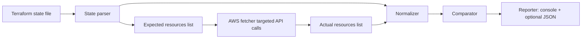

# TF Drift Detector


Tagline: A beginner-friendly Go CLI that detects configuration drift by comparing Terraform state to live AWS resources.

---

## Table of Contents
- [Introduction](#introduction)
- [Features](#features)
- [Use Cases](#use-cases)
- [Challenges & Solution Approach](#challenges--solution-approach)
- [Architecture / Workflow Overview](#architecture--workflow-overview)
- [Prerequisites](#prerequisites)
- [Installation Guide](#installation-guide)
- [Configuration](#configuration)
- [Quick Start Guide](#quick-start-guide)
- [Usage Instructions](#usage-instructions)
- [Example Execution](#example-execution)
- [Project Structure](#project-structure)
- [Troubleshooting](#troubleshooting)
- [Best Practices](#best-practices)
- [FAQ](#faq)
- [Limitations](#limitations)
- [Contributing Guidelines](#contributing-guidelines)
- [License](#license)
- [Support & Contact](#support--contact)

---

## Introduction

`TF Drift Detector` is a compact, beginner-friendly command-line tool written in Go that compares resources declared in a Terraform state file (`terraform.tfstate`) against the actual AWS resources live in your account. Its purpose is to detect "drift" — manual or external changes made directly in AWS (console, CLI, or other automation) that cause the real infrastructure to diverge from the Terraform-managed configuration.

Why this project exists
- Terraform state can become out-of-sync with cloud resources when manual changes are made.
- Operators need a quick, auditable way to highlight differences before applying further Terraform changes.

Key benefits
- Focused comparison: only resources present in the provided tfstate are checked.
- Beginner-friendly: small Go binary, simple flags, and console-first output.
- Deterministic output: colorized human report and optional JSON output for automation.

---

## Features

- Targeted fetch: the tool calls AWS APIs only for resource types present in the supplied `terraform.tfstate`, reducing API noise and cost.
- Normalization: converts Terraform state attributes and cloud API responses into a consistent internal model for accurate comparisons.
- Curated comparisons: excludes Terraform-only or computed-only attributes to avoid false positives.
- Tag-aware diffs: reports tag differences clearly (semicolon-separated list) and detects tag additions/removals.
- Human-readable report: ANSI colorized summary printed to console; JSON report optionally produced with `-out`.
- Verbose diagnostics: `-verbose` flag to show debug logs during parsing, fetching, and comparing.

Practical benefits
- Run before `terraform plan` or `apply` to discover accidental drift.
- Use in CI pipelines (produce JSON) to gate merges or automate alerts.

---

## Use Cases

- DevOps Engineer: verify that S3 buckets, EC2 instances, or RDS instances haven’t been changed manually before applying automated changes.
- Security Audit: detect tag changes or unexpected ACL changes made outside of IaC.
- CI/CD Gate: run as a pre-merge check and block changes if manual drift exists.
- Learning: a beginner-friendly demo for understanding TF state vs live cloud state.

Examples
- Check a local state file for S3 drift: `driftctl -tfstate ./infra/s3/terraform.tfstate -region us-east-1 -verbose`
- Integrate into CI: `driftctl -tfstate state.json -region us-east-1 -out report.json`

---

## Challenges & Solution Approach

Common challenges without this tool
- Too many cloud APIs called for unrelated resources (noise & cost).
- False positives due to computed-only attributes in Terraform state.
- Missing or nested tag fields in the tfstate that a naive parser might miss.

How this tool addresses them
- Targeted fetching: only call APIs for resource types present in the state file.
- Curated attribute lists: avoid comparing Terraform-computed-only attributes.
- Robust tfstate parsing: extracts `tags` and `tags_all` reliably and normalizes attribute types.

Comparison (short):

Without TF Drift Detector:
- Manual diffing, ad-hoc checks, or full-blown drift solutions that are heavy.

With TF Drift Detector:
- Lightweight, reproducible, and deterministic checks focused on the current project’s managed resources.

---

## Architecture / Workflow Overview

High-level flow:

1. Parse local Terraform state (`terraform.tfstate`).
2. Build the set of expected resources (type + id/name).
3. For each expected type, call targeted AWS APIs to fetch the corresponding live resources.
4. Normalize both sides into `models.Resource` and compare curated keys + tags.
5. Produce a human-friendly summary and optional JSON report.

Mermaid flow diagram:



---

## Prerequisites

- Go toolchain (tested with `go 1.24`)
- AWS account with credentials configured (see below)
- AWS permissions for the resources you will check (examples below)
- Tested OS: Windows, Linux, macOS (Go builds cross-platform)

Required AWS permissions (minimum):
- `s3:ListAllMyBuckets`, `s3:GetBucketTagging`, `s3:GetBucketVersioning`, `s3:GetBucketAcl`, `s3:GetBucketEncryption`, `s3:GetBucketWebsite`, `s3:GetBucketCors`, `s3:GetBucketLifecycleConfiguration`, `s3:GetBucketLogging`, `s3:GetBucketLocation`, `s3:GetBucketReplication`
- (Other resource types like EC2/RDS/ELBv2 require Describe/List and Tag APIs)

Note: granting read-only permissions is sufficient for drift detection.

---

## Installation Guide

Clone the repository and build the binary with Go.

```bash
git clone https://github.com/your-org/tf-drift-detector.git
cd tf-drift-detector
# Build binary (Windows example below uses .\bin\driftctl.exe)
go build -v -o ./bin/driftctl ./cmd/driftctl
```

What these commands do
- `git clone` downloads the repository.
- `cd` changes into the project directory.
- `go build` compiles the Go code and places the executable at `./bin/driftctl`.

Windows users (PowerShell):

```powershell
go build -v -o .\bin\driftctl.exe .\cmd\driftctl
```

---

## Configuration

AWS credentials
- The tool uses the standard AWS SDK credential resolution chain. You can provide credentials via:
  - `AWS_PROFILE` environment variable (profile in `~/.aws/credentials`)
  - `AWS_ACCESS_KEY_ID` and `AWS_SECRET_ACCESS_KEY` environment variables
  - Instance/role credentials when running on EC2/ECS

Environment variables example (PowerShell):

```powershell
$env:AWS_PROFILE = "default"
# or
$env:AWS_ACCESS_KEY_ID = "AKIA..."
$env:AWS_SECRET_ACCESS_KEY = "..."
```

Configuration files
- The CLI accepts flags; there is no separate config file by default. You may create wrapper scripts to centralize flags.

Assumptions
- The state file provided is the authoritative Terraform state for the project you want to check.

---

## Quick Start Guide

1. Ensure your AWS credentials are available via environment or profile.
2. Build the binary (`go build` as above).
3. Run a quick check against a local state file:

```powershell
.\bin\driftctl.exe -tfstate .\infra\s3\terraform.tfstate -region us-east-1 -verbose
```

You should see a colorized summary and, with `-verbose`, debug lines showing parsing/fetch steps.

---

## Usage Instructions

Run `driftctl` with flags:

- `-tfstate` : path to the Terraform state file (default: `terraform.tfstate`)
- `-region`  : AWS region to query (default: `us-east-1`)
- `-out`     : optional path to write JSON report
- `-verbose` : enable debug logs
- `-color`   : enable/disable ANSI color in console (default: true)

Example:

```powershell
.\bin\driftctl.exe -tfstate .\infra\s3\terraform.tfstate -region us-east-1 -out .\report.json -verbose
```

Notes
- By default the tool prints the human-readable report to the console and will only write JSON when `-out` is provided.

---

## Example Execution

Sample command (Windows):

```powershell
cd C:\Users\61089907\Downloads\tf-drift-detector
.\bin\driftctl.exe -tfstate .\infra\s3\terraform.tfstate -region us-east-1 -out .\report.json -verbose
```

Expected console output (example):

```
DEBUG: parsing 1 resources from tfstate
DEBUG: Expect resource type=aws_s3_bucket key=tf-drift-bucket-ch
DEBUG: Listing S3 buckets
DEBUG: comparing expected=1 actual=1
--- Drift Scan Summary ---
Expected resources: 1
Actual resources:   1
Diffs found:        1

Detailed diffs:
- Modified: tf-drift-bucket-ch (aws_s3_bucket)
    * acl: expected='<nil>' actual='ac3e0ed9ab43a34a329153d5f09a4916636857c222da00ec5d241045e8eec32b:FULL_CONTROL'
    * server_side_encryption_configuration: expected='[{"rule":[{"apply_server_side_encryption_by_default":[{"kms_master_key_id":"","sse_algorithm":"AES256"}],"bucket_key_enabled":false}]}]' actual='1'
    * website_endpoint: expected='<nil>' actual=''
    * lifecycle_rules: expected='' actual='1'
    * tags: expected='CreatedBy=tf-drift-detector;' actual='owner=charan;CreatedBy=tf-drift-detector;'
Scan complete
```

When `-out report.json` is provided, a JSON file with the normalized `Report` object is written.

---

## Project Structure

Top-level layout

- `cmd/driftctl/` — CLI entrypoint and printing logic
- `internal/tfstate/` — terraform state parsing and normalization
- `internal/awsfetcher/` — targeted AWS API callers for expected resources
- `internal/comparator/` — comparison logic and diff model
- `internal/report/` — report model
- `infra/` — sample infra state(s) used for testing

Important files
- `cmd/driftctl/main.go` — main CLI orchestration and console reporter
- `internal/tfstate/reader.go` — robust tfstate reading (tags, instances, primary)
- `internal/awsfetcher/fetcher.go` — S3/EC2/RDS/ELBv2 fetchers (targeted)
- `internal/comparator/compare.go` — curated attribute comparison and tag formatting

---

## Troubleshooting

Common problems & fixes

- "Permission denied" from AWS calls: ensure your IAM principal has the read-only permissions listed in [Prerequisites].
- "file not found" for tfstate: verify the `-tfstate` path and that the state file is local and readable.
- Unexpected empty attributes: run with `-verbose` to inspect what the parser extracted and what the fetcher returned.
- Build errors: run `go mod tidy` and ensure you are using Go 1.24+.

Debugging steps

1. Re-run with `-verbose` to get debug logs.
2. Inspect `terraform.tfstate` for `tags` vs `tags_all` placement.
3. Use AWS CLI to confirm API responses (e.g., `aws s3api get-bucket-tagging --bucket mybucket`).

---

## Best Practices

- Run drift checks regularly (daily or pre-deploy).
- Keep IAM permissions scoped to least-privilege (read-only for detection).
- Use the JSON `-out` in automation to capture machine-readable diffs.
- Use the tool before performing `terraform apply` to avoid unintended overwrites.

---

## FAQ

Q: Will this tool change any resources?

A: No — the tool is read-only and only performs API `Get`/`Describe` calls.

Q: Can I scan multiple state files at once?

A: The current CLI accepts a single `-tfstate` file. You can script multiple runs or extend the tool to accept multiple inputs.

Q: Why do I see differences in computed fields?

A: The comparator uses curated key lists for common resource types to avoid Terraform-computed-only fields. If you still see computed fields, file an issue or customize `compareKeysForType`.

---

## Limitations

- Only compares resources present in the provided Terraform state. It does not detect resources in the cloud that are entirely unmanaged by Terraform for this project.
- Coverage depends on implemented fetchers; some AWS services require additional API calls and normalization.
- The comparator intentionally excludes some computed attributes; in rare cases, manual tuning of compared keys may be necessary.

## Contributing Guidelines

We welcome contributions. Start with:

1. Fork the repository and create a feature branch.
2. Run `go test ./...` (if tests are added) and `go fmt`.
3. Follow the existing code style (idiomatic Go, no trailing whitespace).
4. Open a pull request with a clear description and tests if applicable.

Coding standards
- Use `gofmt`/`goimports` and keep changes small and focused.

PR guidelines
- One logical change per PR, include context and testing instructions.

---

## License

This project is released under the MIT License. See [LICENSE](LICENSE) for details.

---

## Support & Contact

Report issues via the repository Issues page or contact the maintainer (create an issue with `bug` label). Include:
- Command you ran
- `-verbose` output
- Terraform state sample (trim sensitive values)

---
 
# TF Drift Detector (Go) - MVP

Minimal Terraform drift detection MVP written in Go. Reads a local `terraform.tfstate`, fetches a small set of AWS resources (EC2 instances and S3 buckets), normalizes them, compares expected vs actual, and emits a JSON report.

Quick start

1. Install Go 1.20+
2. Build:

```bash
go build -o bin/driftctl ./cmd/driftctl
```

3. Run (example):

```bash
./bin/driftctl -tfstate examples/sample.tfstate.json -region us-east-1 -out report.json
```

AWS credentials: this tool uses the default AWS credential chain (env vars, shared credentials file, or instance role).

Notes
- This is a beginner-friendly scaffold: add more resource types, persistence, and a dashboard in subsequent iterations.
